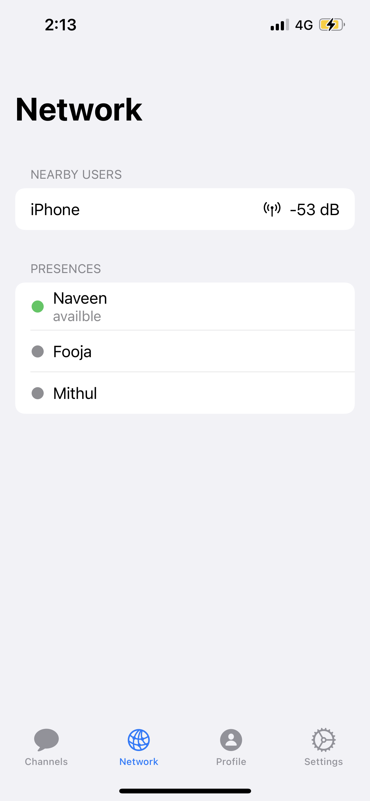
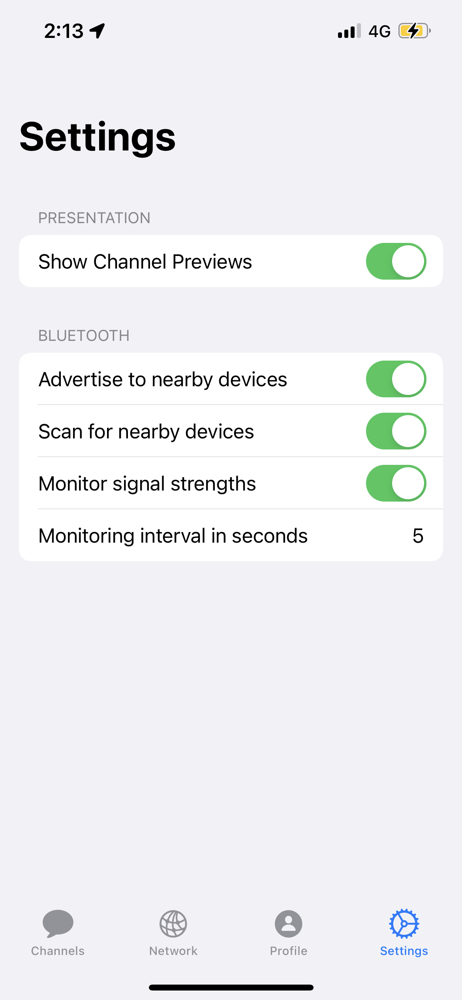
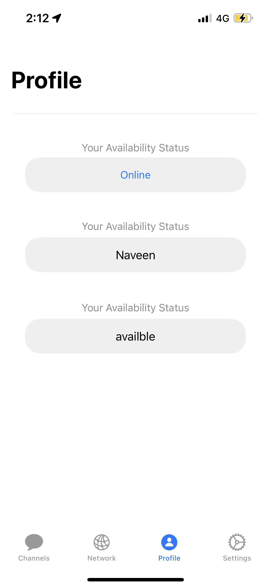
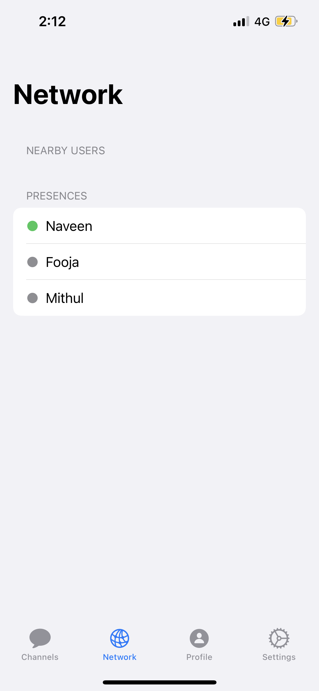
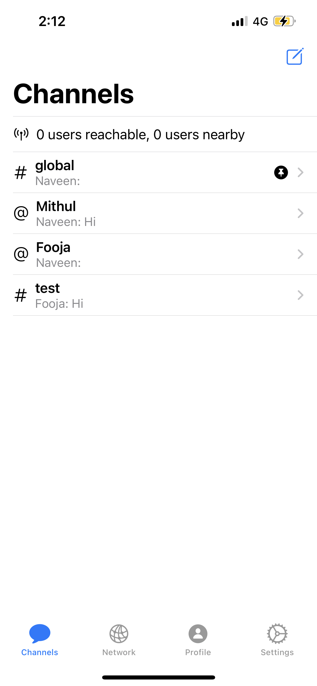
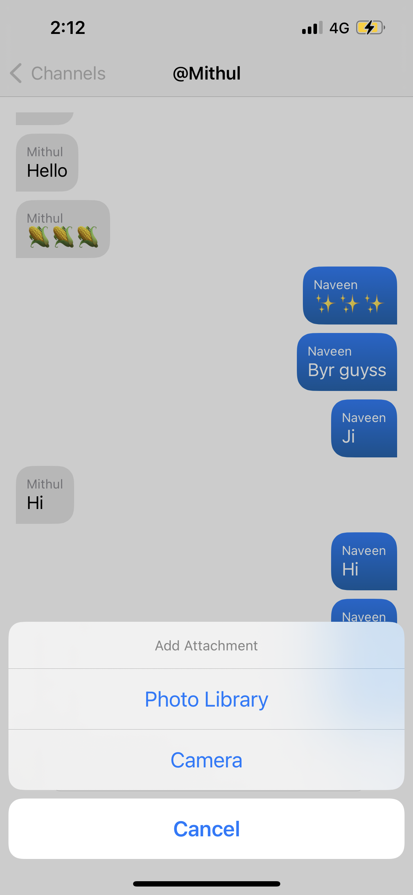
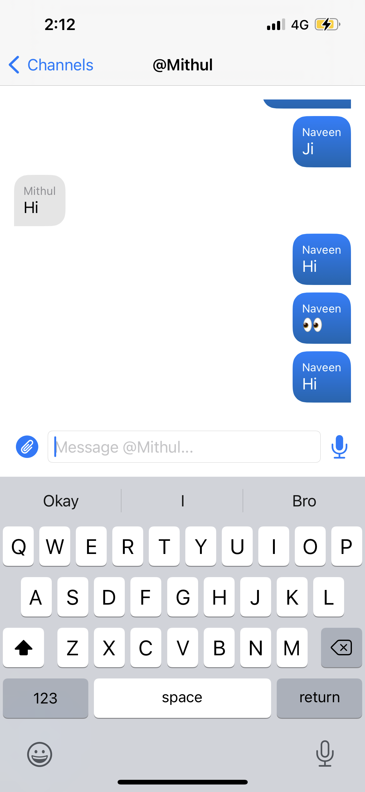
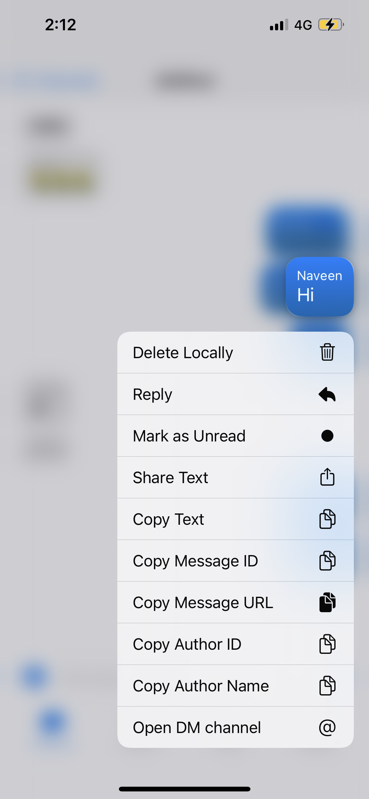

# Cliff App

A whatsapp like chat messenger without internet / cellular networks.

* Fully decentralized architecture, no server or Internet connection required
* Message caching, delayed transmission
* Public and private end-to-end-encrypted messaging channels

  
  

  
  

  
  

  
  

  
  

